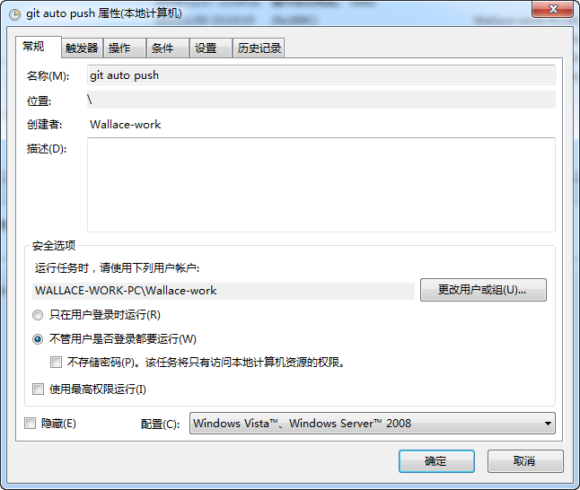
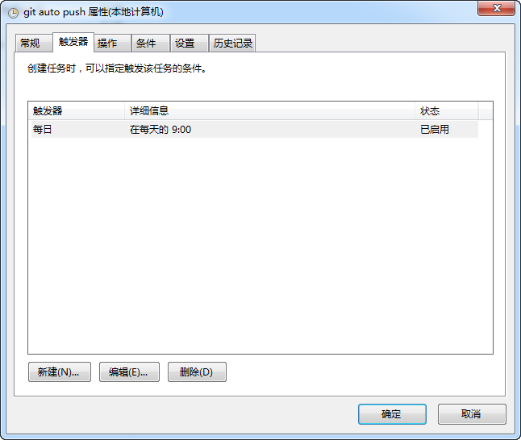
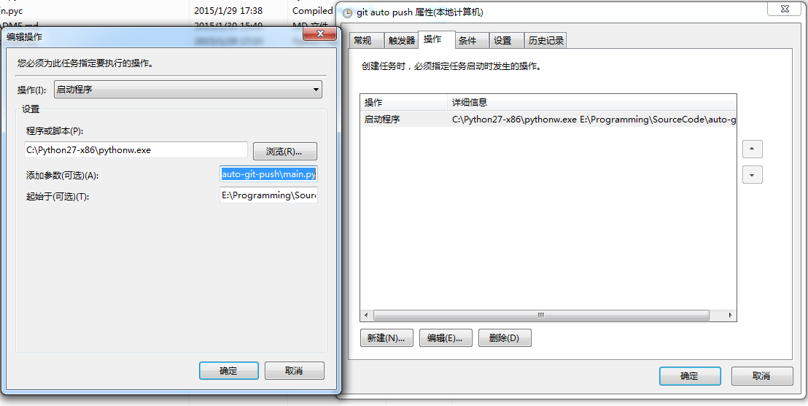

# auto git push

Run git push in your repositories automatically!

# Usage

-   Create `config.ini`


    ```ini
    [repository]
    project-template="E:/Programming/SourceCode/project-template"
    cmake-template="E:/Programming/SourceCode/cmake-template"
    ```

-   Add to scheduled tasks

    -   Win7

        -   GUI

            
            
            

        -   XML

            Refer[git auto push](./auto git push.xml)
